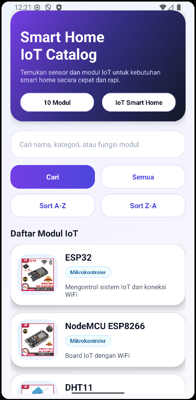
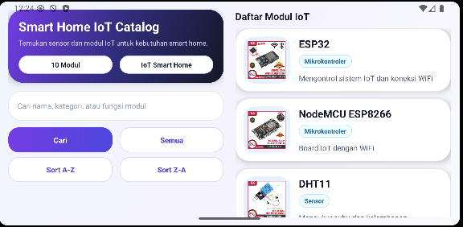
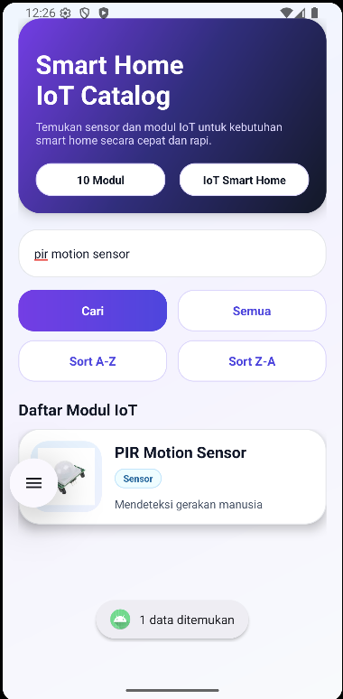
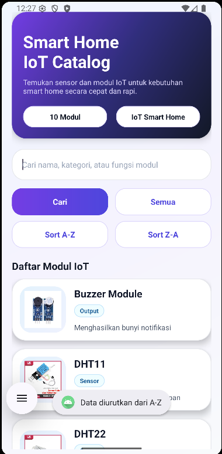
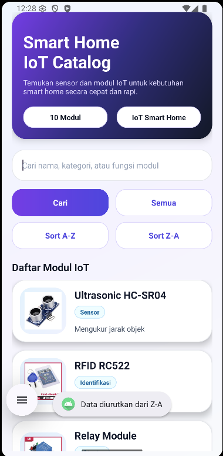
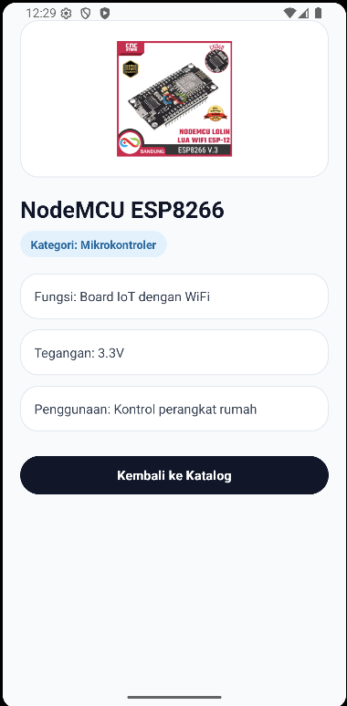
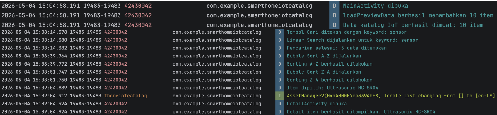

# Smart Home IoT Catalog

Aplikasi Android **Katalog & Pencarian Data Modul IoT Smart Home** yang dibuat sebagai pemenuhan tugas **Ujian Akhir Semester (UAS) Pemrograman Seluler**.

Aplikasi ini menampilkan daftar sensor dan modul IoT (ESP32, NodeMCU, DHT11/22, PIR, Relay, MQ-2, RFID RC522, Ultrasonic, Buzzer) yang umum digunakan dalam sistem **Smart Home**, lengkap dengan fitur pencarian (Linear Search) dan pengurutan (Bubble Sort).

---

## Identitas Mahasiswa

| |                              |
|---|------------------------------|
| **Nama** | I Made Dedy Wanditya         |
| **NIM** | 42430042                     |
| **Mata Kuliah** | Pemrograman Seluler          |
| **Topik Aplikasi** | Katalog Modul IoT Smart Home |
| **Bahasa** | Kotlin                       |
| **IDE** | Android Studio               |

---

## Fitur Aplikasi

| Modul | Fitur | Implementasi |
|---|---|---|
| Modul 2 & 3 | UI Responsif | Layout Portrait + Layout Landscape (split 2 kolom) |
| Modul 4 | Intent Antar Activity | `MainActivity` ➜ `DetailActivity` (`putExtra` 6 field) |
| Modul 5 | Validasi Input | `if-else` + `setError` + `Toast` (kosong & minimal 3 karakter) |
| Modul 6 | Array & Linear Search | `MutableList<IoTItem>` + iterasi `for-in` manual |
| Modul 7 | Bubble Sort A–Z & Z–A | Nested loop + swap manual (tanpa `sortedBy`) |
| Modul 9 | Try-Catch & Logcat | `try-catch` di seluruh handler + Tag Logcat = NIM `42430042` |

---


## Penjelasan Algoritma

### Linear Search (Modul 6)
Dijalankan saat tombol **Cari** ditekan. Algoritma akan menelusuri **setiap item** di dalam array `originalList` satu per satu, lalu memeriksa apakah keyword cocok dengan `name`, `category`, atau `function` (case-insensitive).

```kotlin
for (item in originalList) {
    if (item.name.contains(keyword, ignoreCase = true) ||
        item.category.contains(keyword, ignoreCase = true) ||
        item.function.contains(keyword, ignoreCase = true)) {
        result.add(item)
    }
}
```

### Bubble Sort A–Z (Modul 7)
Dijalankan saat tombol **Sort A–Z** ditekan. Membandingkan dua item berdampingan; jika urutan salah, dilakukan **swap manual** menggunakan variabel `temp`.

```kotlin
for (i in 0 until sortedList.size - 1) {
    for (j in 0 until sortedList.size - i - 1) {
        if (sortedList[j].name.compareTo(sortedList[j + 1].name, ignoreCase = true) > 0) {
            val temp = sortedList[j]
            sortedList[j] = sortedList[j + 1]
            sortedList[j + 1] = temp
        }
    }
}
```

### Bubble Sort Z–A
Sama persis dengan A–Z, namun kondisi perbandingan dibalik (`< 0` dan bukan `> 0`).

---

## Penanganan Error & Logcat

Setiap event penting (buka activity, klik tombol, hasil search, hasil sort, klik item) tercatat di Logcat dengan **Tag = NIM `42430042`**.

```kotlin
companion object {
    private const val TAG = "42430042"
}

try {
    Log.d(TAG, "Pencarian selesai: ${searchResult.size} data ditemukan")
} catch (e: Exception) {
    Log.e(TAG, "Error saat melakukan pencarian: ${e.message}", e)
    Toast.makeText(this, "Terjadi kesalahan saat pencarian", Toast.LENGTH_SHORT).show()
}
```

---

## Screenshot Aplikasi

### Tampilan Portrait


### Tampilan Landscape


### Hasil Pencarian Data (Linear Search)


### Hasil Pengurutan Data A–Z (Bubble Sort)


### Hasil Pengurutan Data Z–A (Bubble Sort)


### Halaman Detail (Intent + getExtra)


### Logcat dengan Tag NIM `42430042`


---

## Daftar Modul IoT yang Tersedia di Katalog

| Nama Modul | Kategori | Tegangan |
|---|---|---|
| ESP32 | Mikrokontroler | 3.3V |
| NodeMCU ESP8266 | Mikrokontroler | 3.3V |
| DHT11 | Sensor | 3.3V – 5V |
| DHT22 | Sensor | 3.3V – 6V |
| PIR Motion Sensor | Sensor | 5V |
| Relay Module | Aktuator | 5V |
| MQ-2 Gas Sensor | Sensor | 5V |
| RFID RC522 | Identifikasi | 3.3V |
| Ultrasonic HC-SR04 | Sensor | 5V |
| Buzzer Module | Output | 3.3V – 5V |

---

## Lisensi

Project ini dibuat untuk UAS Pemrograman Seluler.

---

> Dibuat dengan ❤️ oleh **I Made Dedy Wanditya – 42430042**
